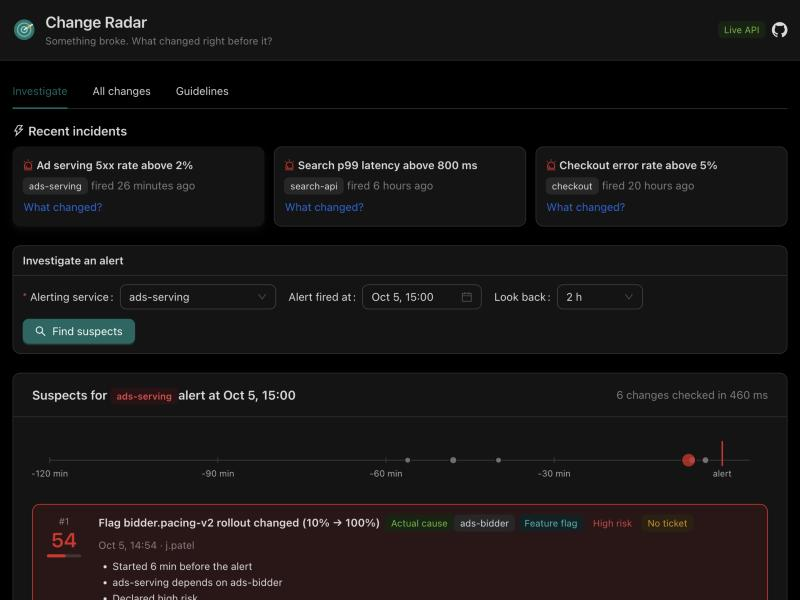
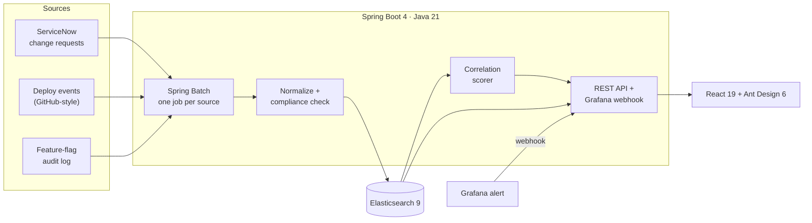

# Change Radar

**Something broke. What changed right before it?**

When an alert fires, the first question is almost always "what changed?" The answer is usually spread across a
change-management system, a deploy log and a feature-flag audit trail. Change Radar pulls all three into one
index and, given an alerting service and a time, ranks the recent changes most likely to be the cause, with a
plain-English reason for each.

**Live demo:** https://clarkngo.github.io/change-radar/ (static build; see [Demo mode](#demo-mode))



> A portfolio project inspired by my work on eBay's ads monitoring platform, where I brought change data into the
> team's incident tooling. Linking a revenue drop to a recent change went from hours in some cases to within
> 10 minutes, and sometimes seconds. All code here is original and all data is synthetic.

## What it does

| | |
|---|---|
| **Investigate** | Pick the alerting service and the time the alert fired, and get the top 10 suspect changes scored 0–100 on a timeline, each with the reasons behind its score. |
| **All changes** | One searchable, filterable table of every change from every source. |
| **Guidelines** | Per-team share of changes that have a ticket, an owner and a rollback plan, so teams can see their own numbers. |
| **Grafana webhook** | Point a Grafana alert contact point at `/api/webhooks/grafana`. Every firing alert with a `service` label is matched against recent changes automatically. |

## Architecture



**Ingestion.** Each source is a `ChangeSource` adapter. The three mocks differ on purpose, the same way real
systems do:

| Source | Paging | Time format | Shape |
|---|---|---|---|
| ServiceNow | `sysparm_offset` / `sysparm_limit` | `yyyy-MM-dd HH:mm:ss` (UTC) | `{"result": [...]}` |
| Deploys | 1-based `page` / `per_page` | ISO-8601 | bare array, `org/service` repo names |
| Feature flags | 0-based `page` / `size` | epoch millis | `{"items": [...], "hasMore": bool}` |

A Spring Batch chunk step reads each source page by page, normalizes every record into one `ChangeEvent`, checks
it against the change guidelines and upserts it into Elasticsearch. Ids are `source:externalId`, so re-ingesting is
idempotent. Non-production deploys are filtered out by the processor.

**Correlation.** For an alert on service *S* at time *T*, the scorer gets every change in `[T − window, T + 5 min]`
and multiplies four factors:

| Factor | Values |
|---|---|
| Proximity | `0.5 ^ (minutes before alert / 15)`. A change 15 min before scores half as much as one at the alert time. Changes up to 5 min *after* the alert get 0.3, to allow for clock skew. |
| Blast radius | Same service 1.0 · direct dependency 0.7 · two hops 0.4 · further 0.2 · unrelated 0.1 (0.3 for infra) |
| Change type | Deploy 1.0 · config / infra 0.9 · feature flag 0.85 |
| Declared risk | High 1.2 · medium 1.0 · low 0.85 |

Dependencies come from the service catalog in [`application.yml`](backend/src/main/resources/application.yml).
Distance is the shortest path through `dependsOn` edges, found with a breadth-first search that handles cycles.

## Run it

**Everything in Docker** (Elasticsearch, backend, frontend):

```bash
docker compose up --build
```

Open http://localhost:5173. The backend starts in the `demo` profile: it serves its own mock sources with 72 hours
of generated history and three planted incidents, then ingests them every 60 seconds. If 8080 or 5173 is taken, set
`BACKEND_PORT=…` or `FRONTEND_PORT=…`.

**For development:**

```bash
docker compose up -d elasticsearch
cd backend && ./mvnw spring-boot:run          # http://localhost:8080
cd frontend && npm install && npm run dev     # http://localhost:5173, proxies /api to 8080
```

### API

```bash
# Rank suspects for an alert (at defaults to now, windowMinutes to 120)
curl "localhost:8080/api/correlate?service=checkout&at=2026-10-05T02:00:00Z"

# Search changes: free text, filters, paging
curl "localhost:8080/api/changes?q=migrate&service=checkout&compliant=false"

# Per-team guideline compliance (defaults to the last 7 days)
curl "localhost:8080/api/compliance"

# Grafana unified-alerting webhook payload
curl -X POST localhost:8080/api/webhooks/grafana -H 'Content-Type: application/json' -d '{
  "status": "firing",
  "alerts": [{"status": "firing", "labels": {"alertname": "CheckoutErrors", "service": "checkout"},
              "startsAt": "2026-10-05T02:00:00Z"}]}'

# Run ingestion now / see the last run per source
curl -X POST localhost:8080/api/ingest
curl localhost:8080/api/ingest/status
```

To use real sources, run without the `demo` profile and set `SERVICENOW_URL`, `DEPLOYS_URL` and `FLAGS_URL`.

## Demo mode

GitHub Pages can't run a backend, so the Pages build (`VITE_DEMO=true`) loads
[`frontend/public/demo/snapshot.json`](frontend/public/demo/snapshot.json), exported from a real run, and answers
the same API calls in the browser. Timestamps are shifted so the data always looks recent. Scoring uses a TypeScript
copy of the Java scorer. Both are tested against the same vectors in
[`shared/scoring-cases.json`](shared/scoring-cases.json), so they can't drift apart.

To refresh the snapshot from a running backend:

```bash
cd frontend && BACKEND_URL=http://localhost:8080 npm run snapshot
```

## Tests

```bash
cd backend && ./mvnw verify   # unit tests + Testcontainers integration test (needs Docker)
cd frontend && npm test
```

- **Integration test.** Starts Elasticsearch 9 in a container, ingests from the mock sources over HTTP, and checks
  that re-ingesting doesn't create duplicates, that search combines text and filters, and that every planted
  incident ranks its real cause first.
- **Demo data test.** Checks that every planted culprit ranks first at several different start times, with no
  Elasticsearch involved.
- **Shared scoring cases.** The same 9 vectors run against both the Java and TypeScript scorers.
- **Normalization tests.** Cover each source's quirks: time formats, risk vocabularies, blank backout plans and
  irreversible migrations.

## Design decisions

- **One Spring Batch job per source, not one job with three steps.** A failing ServiceNow API shouldn't stop deploy
  events from being indexed. Each source reports its own status at `/api/ingest/status`.
- **An explainable score instead of a learned model.** During an incident, an on-call engineer has to trust the
  ranking quickly. Four multiplied factors with written reasons are easy to check and argue with. A learned model
  could rank better given labeled incident history, which this project doesn't have.
- **Missing metadata doesn't raise suspicion.** An undocumented change isn't more likely to be the cause; it's just
  harder to investigate. The guidelines report keeps that problem separate from incident ranking.
- **Fixed-length dependency hops.** The catalog is static config. In production it would come from a service registry
  or tracing data, and blast radius could be weighted by traffic.
- **Known limits.** Correlation reads up to 5,000 changes per window and the compliance report aggregates in the JVM,
  which is fine at this scale. At real volume both should use Elasticsearch aggregations. There is no auth.

## Project layout

```
backend/    Spring Boot 4: ingest/ (Batch + source adapters), correlate/, compliance/, web/, demo/
frontend/   React 19 + Vite + Ant Design 6: api/ (live + demo clients, scorer), views/
shared/     Scoring test vectors used by both the backend and the frontend
```
